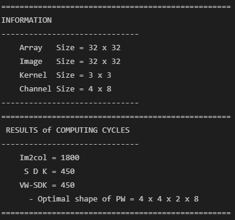
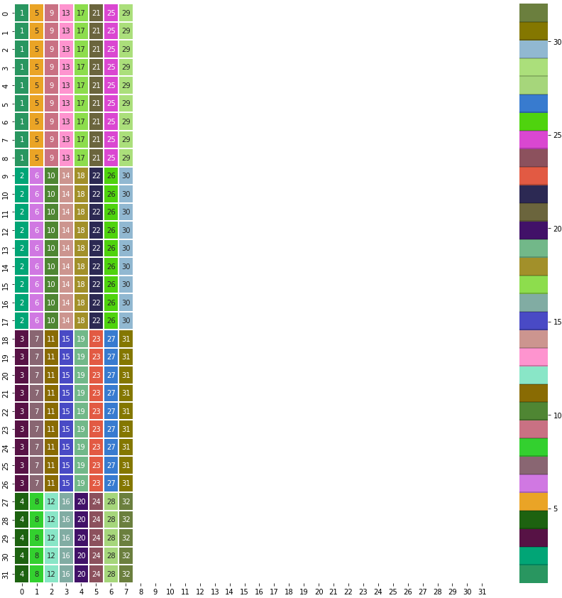
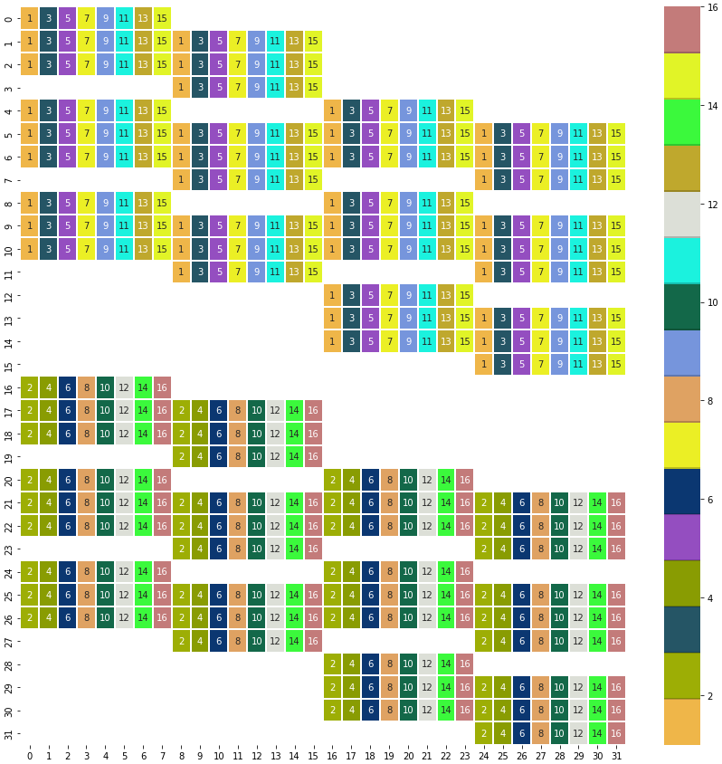
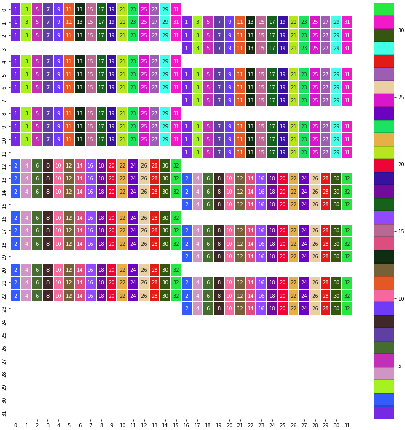

# Visualization-of-weight-mapping

This codes are the visualization of weight mapping on the PIM architecture based on VW-SDK. 

## Usage
### main.py

* This code inputs the parameters for computation.
* You have to input some parameters for calculation and visualization.
* image size, kernel size, input channel, output channel, rows of PIM array, columns of PIM array, mapping method
 
ex 1) image, kernel, ic, oc, ar, ac, method = 32, 3, 8, 16, 32, 32, 'VW-SDK'
ex 2) image, kernel, ic, oc, ar, ac, method = 32, 3, 8, 16, 32, 32, 'SDK'
ex 3) image, kernel, ic, oc, ar, ac, method = 32, 3, 8, 16, 32, 32, 'im2col'

### function_1.py

* This code is the functions for finding optimal weight mapping according to the method and visualziation

## Results

First, the computing cycle is calculated.

Then, the mapping is visualized.

ex 1) im2col

ex 2) SDK

ex 3) VW-SDK

